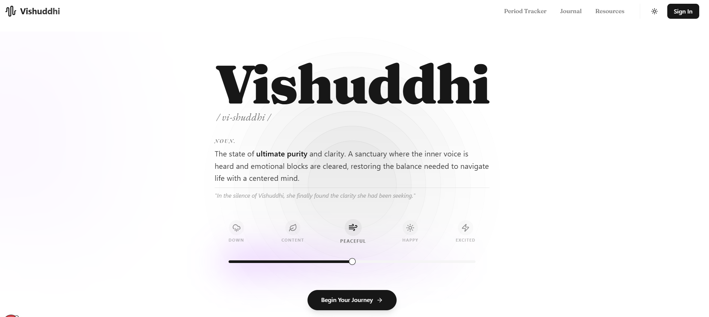

# Vishuddhi — AI Mental Wellness Companion

Vishuddhi is an **AI-powered mental wellness platform** designed to help users understand and manage stress through **AI conversations, journaling, predictive analytics, and guided wellness activities**.

The system combines **machine learning, LLM-based emotional analysis, and behavioral tracking** to provide personalized mental health insights.


# Vision

Mental health tools should be **private, supportive, inclusive, and accessible**.

Vishuddhi creates a **safe digital space for reflection and emotional clarity**, helping users process thoughts, track stress patterns, and access support resources when needed. The platform is also **female-aware**, integrating menstrual cycle insights to provide more personalized stress analysis and wellness support.

---

# Landing Page

The landing page introduces the concept of **Vishuddhi — a sanctuary for mental clarity and reflection**.



The interface provides:

* explanation of the project philosophy
* emotional awareness UI
* onboarding to begin a wellness journey

---

# Dashboard

After signing in, users land on the **wellness dashboard** where they can start therapy sessions and track mental activity.

**Key Components**

* Start AI therapy session
* Mood tracking
* Behavioral check-ins
* Wellness activity distribution

📷 **Screenshot:**
[View Dashboard](screenshots/home.PNG)

---

# Authentication

The system includes a clean authentication interface for users.

Features:

* secure login
* session management
* personalized user context

📷 **Screenshot:**
[View Login Screen](screenshots/signin.PNG)

---

# AI Therapy Chat

Vishuddhi includes an **AI therapy interface** powered by **Gemini SDK** that provides empathetic responses and contextual support.

Features:

* conversational AI therapist
* multi-session chat history
* contextual memory
* emotionally aware responses

📷 **Screenshot:**
[View Chat Interface](screenshots/chat%20interface.PNG)

---

# Smart Journaling System

Users can maintain a **daily journal of thoughts and emotions**.

The system analyzes journal entries and generates insights to help users reflect on their mental state.

Features:

* expandable journal entries
* emotional analysis
* AI insights from reflections
* journaling history

📷 **Screenshot:**
[View Journaling UI](screenshots/journals.PNG)

---

# 🐘 Pink Elephant Insight System

The platform uses the **Pink Elephant Theory** concept to help users understand cognitive suppression and emotional resistance.

Instead of ignoring stress triggers, the system encourages healthy reflection.

📷 **Screenshot:**
[View Insight Panel](screenshots/paradox%20insights.PNG)

---

# Stress Trend Analytics

Vishuddhi provides **predictive stress analytics** based on behavioral data.

The system analyzes patterns from:

* sleep
* activity
* journaling sentiment
* academic workload
* emotional check-ins

This generates a **visual stress trend dashboard**.

📷 **Screenshot:**
[View Stress Analytics](screenshots/stress.PNG)

---

# Period Cycle Stress Tracking

The platform integrates **menstrual cycle tracking** to provide personalized stress insights for female users.

Features:

* cycle prediction
* flow tracking
* stress correlation with hormonal cycles

📷 **Screenshot:**
[View Cycle Tracker](screenshots/cycle%20tracker.PNG)

---

# Predictive Health Insights

Users receive predictions and cycle statistics that help track health trends.

Example metrics:

* average cycle length
* predicted next period
* health timeline

📷 **Screenshot:**
[View Prediction Panel](screenshots/prediction.PNG)

---

# Anxiety Relief Activities

Vishuddhi provides **interactive exercises for emotional regulation**.

Examples:

* breathing exercises
* meditation guidance
* calming visual environments

These help users regulate anxiety and stress.

📷 **Screenshot:**
[View Activities](screenshots/activities.PNG)

---

# Support Directory

The system includes a **medical directory** for locating nearby professionals.

Categories include:

* general physicians
* gynecologists
* psychiatrists
* pediatric specialists

📷 **Screenshot:**
[View Medical Directory](screenshots/medical-directory.PNG)

---

# Research & Resources

Users can explore mental health concepts and psychological frameworks.

Topics include:

* project mission
* Pink Elephant theory
* mental wellness principles

📷 **Screenshot:**
[View Resources Page](screenshots/resources.PNG)

---

# Machine Learning Integration

Vishuddhi integrates **ML models for stress prediction**.

### Stress Level Classifier

Predicts:

```
No Stress
Low Stress
Moderate Stress
High Stress
```

Inputs include:

* heart rate
* sleep quality
* physical activity
* screen time
* journal sentiment
* academic workload
* many more behavioral indicators

### Menstrual Cycle Stress Model

Predicts stress levels based on:

* period flow
* cycle irregularity
* hormonal patterns

The models use **Random Forest algorithms with hyperparameter tuning**.

---

# System Architecture

High-level system flow:

```
User Interaction
       ↓
Frontend (Next.js + React)
       ↓
Backend API
       ↓
AI Processing Layer
       ↓
Gemini AI / ML Models
       ↓
Insights + Responses
       ↓
MongoDB Storage
```

---

# 🛠 Tech Stack

### Frontend

* Next.js
* React
* TailwindCSS
* Framer Motion
* Recharts
* Shadcn UI

### Backend

* Node.js
* Express

### AI & ML

* Google Gemini API
* Random Forest Models
* Scikit-learn

### Database

* MongoDB

---

# 🔐 Privacy & Safety

Vishuddhi follows **privacy-first principles**:

* user journal data stored securely
* mental health conversations kept private
* HIPAA-aware architecture principles

---

# Future Improvements

Planned enhancements include:

* wearable device integration
* long-term mental health analytics
* therapist collaboration tools
* crisis support integration

---

# 📦 Installation

Clone the repository:

```bash
git clone https://github.com/sruthisami/vishuddhi.git
```

Install dependencies:

```bash
npm install
```

Run development server:

```bash
npm run dev
```

---

# Outcome

* building **AI-driven mental health applications**
* integrating **LLMs into wellness systems**
* combining **machine learning with behavioral analytics**
* designing **empathetic AI user interfaces**

